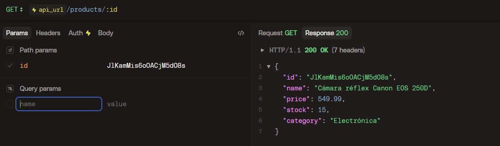

## Ejemplos de uso

En este documento se muestra como se usa cada endpoint

### Auth

- ``POST /auth/register``

   

- ``POST /auth/login``

   

### Products

estas rutas estan protegidas por el auth middleware, el cual requiere enviar por el header "authorization" el token que retornan los endpoints `/auth/register` o `/auth/login`. el token debe iniciar con el texto "Bearer {token}"

ejemplo de respuesta sin enviar el header autorization

   

- ``GET /api/products``

   

- `GET /api/products/:id`

   

- `POST /api/products/create`

   

- `PUT /api/products/:id`

   

- `DELETE /api/products/:id`

   